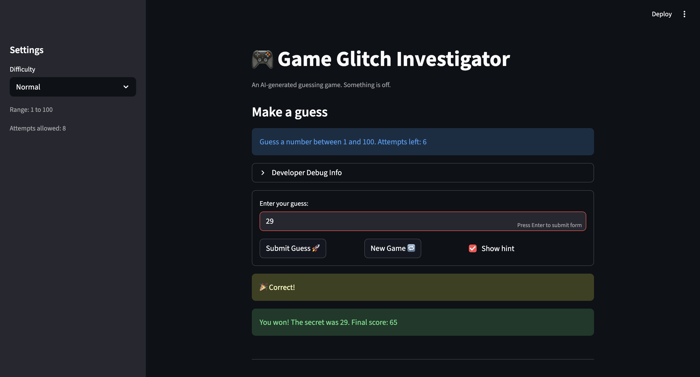

# 🎮 Game Glitch Investigator: The Impossible Guesser

## 🚨 The Situation

You asked an AI to build a simple "Number Guessing Game" using Streamlit.
It wrote the code, ran away, and now the game is unplayable.

- You can't win.
- The hints lie to you.
- The secret number seems to have commitment issues.

## 🛠️ Setup

1. Install dependencies: `pip install -r requirements.txt`
2. Run the broken app: `python -m streamlit run app.py`

## 🕵️‍♂️ Your Mission

1. **Play the game.** Open the "Developer Debug Info" tab in the app to see the secret number. Try to win.
2. **Find the State Bug.** Why does the secret number change every time you click "Submit"? Ask ChatGPT: _"How do I keep a variable from resetting in Streamlit when I click a button?"_
3. **Fix the Logic.** The hints ("Higher/Lower") are wrong. Fix them.
4. **Refactor & Test.** - Move the logic into `logic_utils.py`.
   - Run `pytest` in your terminal.
   - Keep fixing until all tests pass!

## 📝 Document Your Experience

- [] Describe the game's purpose.
- [] Detail which bugs you found.
- [] Explain what fixes you applied.

**Game Purpose:**
This is a number-guessing game where the player tries to identify a hidden number within a set number of attempts. The difficulty level selected at the start determines the range of possible numbers, and after each guess the game tells the player whether the secret number is higher or lower.

**Bugs Found:**

- **Reversed hints:** The "Higher/Lower" feedback was flipped — when the secret number was higher, the game told the player to guess lower, and vice versa.
- **State not resetting:** When a new game began, the attempt counter and score were not cleared, so stale values from the previous round carried over.
- **Secret number out of range:** Changing the difficulty level updated the displayed number range, but the secret number was not regenerated to match — so it could fall completely outside the new range.

**Fixes Applied:**
I worked with Claude and GitHub Copilot to resolve each bug. For every issue, I described the exact broken behavior in my prompt and asked for a targeted fix. I reviewed each suggestion before applying it, accepting only the changes that directly addressed the bug without altering unrelated parts of the code.

## 📸 Demo

- [ ] [Insert a screenshot of your fixed, winning game here]
      

## 🚀 Stretch Features

- [ ] [If you choose to complete Challenge 4, insert a screenshot of your Enhanced Game UI here]
